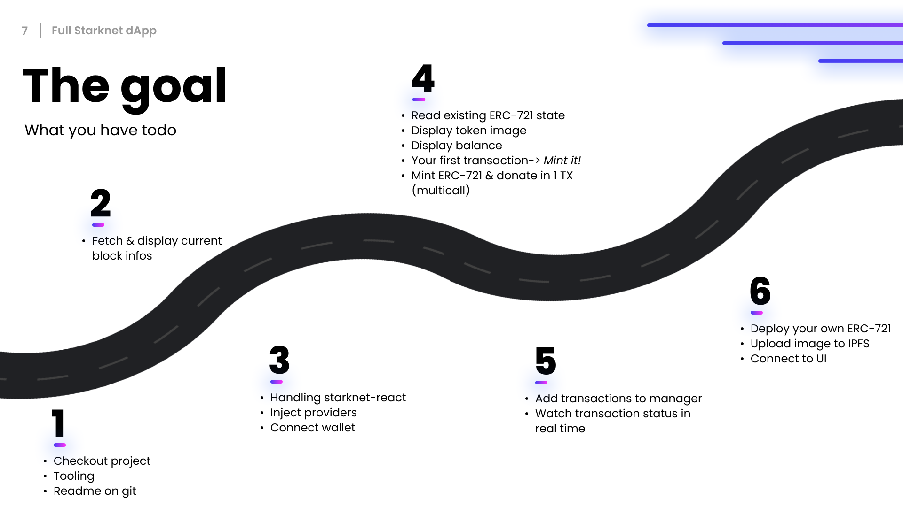

# NextJS - Starknet-react - Cairo • Workshop

**StarknetCC** - Full dApp workshop by AVNU team

You'll find the PDF presentation [here](./files/presentation.pdf)

## Introduction

This workshop will show you how to dev a full Starknet dApp with NextJS & [Starknet-react](https://github.com/apibara/starknet-react), including multi-wallets support([Argent web wallet](https://github.com/argentlabs/argent-x) | [Argent-x](https://github.com/argentlabs/argent-x) | [Braavos](https://braavos.app/)) and multi-call transactions.

You'll also use an ERC-721 contract, with a 'mint' function (see [ABI](src/contracts/abis/AVNUNft.json)).

This workshop currently run on the **Starknet Goerli Testnet** 

## Use case

Explore the contract interactions in NextJS by using an existing ERC-721 contract & ERC-20 contracts deployed on Starknet.

- Contract interactions
    - Start with existing contracts
    - Deploy & connect your own
- Display current information
  - Last block
  - Transactions
- ERC-721 
    - mint
    - balanceOf
- Minting & send (multicalls)


## The Goal



## Prerequisite

To follow this workshop you should at least:
- Have a Starknet compatible wallet installed (with some Starknet Goerli ETH in wallet to do TX's)
- Have basic knowledge in ReactJS / NextJS framework
- Have basic knowledge in Cairo smart contracts development
- Have basic knowledge on how Starknet works(BC in general, Account abstraction, ...)

About the tooling:
- IDE
- Yarn or NPM

Clone the repository

```bash
git clone git@github.com:avnu-labs/avnu-dapp-workshop.git
cd avnu-dapp-workshop
```

Install Dependencies

```bash
yarn | npm install 
```

Run in dev

```bash
yarn dev | npm run dev
```

## File tree

Here are the interesting files tree you'll have to update/use during this workshop

- __app__
  - layout.tsx
  - page.tsx
- __assets__
  - __abis__
    - ERC20.json
    - AVNUNft.json
- __lib__
    - __shared__
        - __components__
          - __layout__
          - __nft__
          - __transactions__
        - __models__
          - nft-metadata.tsx
        - __services__
    - __wallet__
        - __components__
          - connect-button.tsx
          - connect-wallet-modal.tsx

## TODO

1) Familiarize a little with the project
    1) See the file tree
    2) Contract addresses are located in [environment](/environment.ts)
    3) (use of [ChakraUI](https://chakra-ui.com/getting-started) components library)
    4) Uncomment part by part the workshop
2) Fetching block infos
    1) Update the [starknet providers](lib/shared/components/layout/provider.tsx) to connect to the default Starknet Goerli provider by using [Starknet-react](https://github.com/apibara/starknet-react)
    2) Update the [footer component](lib/shared/components/layout/footer.tsx) to fetch & display the current block infos
    3) (The UI part is already done here)
3) Wallet connect
    1) Look at the [Connect button component](lib/wallet/components/connect-button.tsx) & [Connect wallet modal component](lib/wallet/components/connect-wallet-modal.tsx)
    2) Update it to ask user wallet connection by using [Starknet-react](https://github.com/apibara/starknet-react) or [Get starknet by argent](https://github.com/argentlabs/argent-x) if you want to use argent web wallet.
    3) You should be able to connect with Braavos or ArgentX, and see your current address on the UI
4) Managing ERC-721
    1) Start by taking a look at the [NFT component](lib/shared/components/nft/nft.tsx) & [Mint button component](lib/shared/components/nft/mint-button.tsx)
    2) You can now update the [NFT component](lib/shared/components/nft/nft.tsx) to
        1) Fetch & display the name, description and image of the NFT by fetching metadata
        2) Fetch the balance of the connected account
        3) Mint the NFT by using the mint button
           1) Simple call, only mint
           2) Multi-call, mint and donate
5) Managing transactions ---------------------------
    1) Look at the [Current transaction component](lib/shared/components/transactions/current-transaction.tsx) & the [Transactions list component](lib/shared/components/transactions/transactions-list.tsx)
    2) Here you'll have to
        1) Watch the last transaction registered by the app & display the current status in real time
        2) Display all registered transactions by the app
6) Deploy your own ERC-721 contract
    1) You can put aside IDE for the time & open your terminal
    2) You can use the OpenZeppelin [ERC-721 contract](https://github.com/OpenZeppelin/cairo-contracts/tree/main/src/openzeppelin/token/erc721)
    3) Use [Starkli](https://github.com/xJonathanLEI/starkli) to compile, declare & deploy the contracts
       1) Wait until the contract is deployed
    4) Once it's ok, you can test it by calling *mint* on the deployed contract to verify
        1) With the CLI
        2) With the [voyager](https://goerli.voyager.online/)
   5) Declare & upload your metadata.json to IPFS (or other if you prefer)
   6) Set the tokenURI of your contract to the IPFS link
   7) You can now replace the nftAddress in [the environment file](environment.ts) to use your own

## Contract addresses

#### AVNU ERC-721
    0x039eb1299cbb259edabb45376ec742497c67150b9adc2d9c3c026a8cc58c634a

## Go further

There some improvements you can make to improve this workshop, here is a non-exhaustive list:

- Use other starknet-reacts hooks
  - UseStarkName()
- Save transactions in local storage
- Display current transaction information on the UI (toast, history panel, ...)
- Auto reload of balance after mint
- Implement a button to be able to add a specific token to your wallet
- ...

## Docs

Here is all the docs you'll need to complete the workshop

https://github.com/apibara/starknet-react

https://www.starknetjs.com/

https://www.npmjs.com/package/@argent/get-starknet

https://github.com/OpenZeppelin/cairo-contracts

https://github.com/xJonathanLEI/starkli


## License

This workshop is released under the [AGPL-3.0-only](LICENSE).